<div align="center">



</div>

---

<div align="center">

[](https://git.io/typing-svg)

</div>

---

## 🌸 About Me

```python
class RabiaSohail:
    name       = "Rabia Sohail"
    role       = "AI Developer & Full-Stack Engineer"
    location   = "Pakistan 🇵🇰"
    passion    = ["Autonomous AI Systems", "Web Development", "Hackathons"]
    currently  = "Building AI Employee — an autonomous digital worker 🤖"
    learning   = ["LLM Agents", "Multi-Agent Systems", "Cloud Architecture"]
    fun_fact   = "I built an AI that works 24/7 so I don't have to 😄"
```

---

## 🚀 Tech Stack

<div align="center">

### 🧠 AI & Automation


### 🌐 Web Development


### 🛠️ Tools & Platforms


### 📱 Social & Productivity


</div>

---

## 🏆 Featured Project — AI Employee

<div align="center">

> **Personal AI Hackathon — Platinum Tier 💎 — All 4 Tiers 100% Complete**

</div>

An autonomous AI system that acts as a **full-time digital employee** — managing emails, posting on social media, generating invoices, handling approvals, and running **24/7 without human intervention**.

| Feature | Description |
|---------|-------------|
| 📧 **Email AI** | Gmail monitoring → AI draft replies → Human approval → Auto-send |
| 📱 **Social Media** | Auto-post to LinkedIn, Twitter, Discord, WhatsApp with AI images |
| ✅ **Approvals** | Human-in-the-loop dashboard — approve/reject with real-time updates |
| 💰 **Accounting** | Odoo Community 17.0 — invoices, partners, ledger (Rs 520,000 pipeline) |
| 🤖 **7 Agents** | Autonomous agents running 24/7: email, social, health, scheduler, backup |
| 🎨 **AI Images** | HuggingFace Stable Diffusion XL generates post images on demand |

```
Tier      Status
━━━━━━━━━━━━━━━━━━━━━━━━━━━━━━━━━━
🥉 Bronze   ████████████████  100%  ✅
🥈 Silver   ████████████████  100%  ✅
🥇 Gold     ████████████████  100%  ✅
💎 Platinum ████████████████  100%  ✅
```

---

## 📊 GitHub Stats

<div align="center">


</div>

<div align="center">

[](https://git.io/streak-stats)

</div>

---

## 🌟 What I'm Working On

```
🔨  AI Employee — Autonomous Digital Worker (Platinum Tier Complete!)
📚  Learning Multi-Agent LLM Architectures
🌱  Exploring Cloud-Native AI Deployments
🎯  Next: Contributing to Open Source AI Projects
```

---

## 🎯 Hackathon Achievements

<div align="center">

| Hackathon | Project | Tier | Status |
|-----------|---------|------|--------|
| Personal AI Employee Hackathon 2026 | AI Employee — Autonomous Digital Worker | 💎 Platinum | ✅ Complete |

</div>

---

## 📫 Connect With Me

<div align="center">

[](https://github.com/rabiasohail098)
[](https://linkedin.com/in/rabiasohail098)

</div>

---

<div align="center">

```
✨  "Code is poetry, and every program is a story waiting to be told."  ✨
```


</div>
